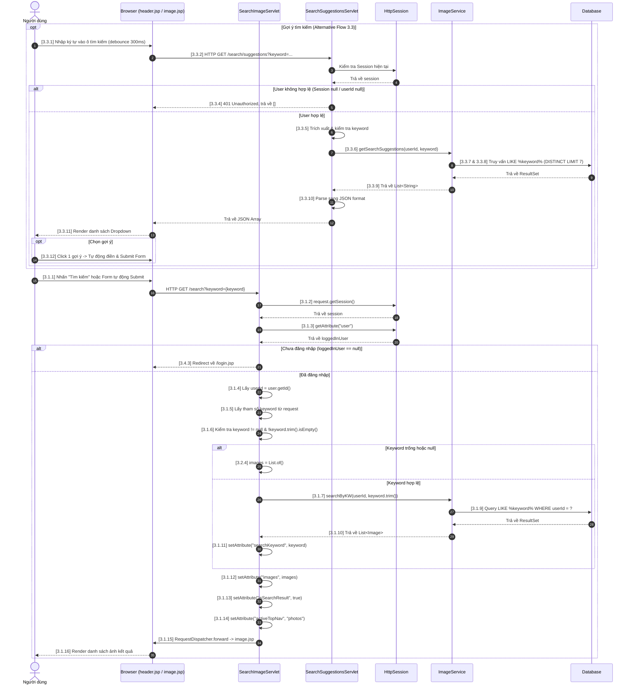

USE CASE SPECIFICATION
USECASE 03: Tìm kiếm ảnh

1. Introduction
Use case này mô tả quy trình người dùng thực hiện tìm kiếm các hình ảnh cá nhân đã lưu trữ trong hệ thống bằng cách nhập các từ khóa liên quan (như tên ảnh, thẻ tag, hoặc mô tả).

2. Use Case Description
Tên Use Case: Tìm kiếm ảnh
Số hiệu Use Case: 03
Mô tả: Cho phép người dùng nhập từ khóa tìm kiếm trên giao diện. Hệ thống sẽ tiếp nhận từ khóa, xác thực quyền truy cập của người dùng (thông qua Session), truy vấn cơ sở dữ liệu để lọc ra danh sách các hình ảnh phù hợp và trả về kết quả hiển thị lên màn hình.
Tác nhân chính: Người dùng (User đã đăng nhập)
Tác nhân phụ: Hệ thống (Database)

3. Pre-Conditions
Người dùng đã đăng nhập thành công và có một phiên làm việc (Session) chứa thông tin thực thể User hợp lệ.
Hệ thống đã có kết nối với Cơ sở dữ liệu.

4. Trigger
Người dùng nhập từ khóa vào ô tìm kiếm trên thanh điều hướng hoặc trang quản lý ảnh và nhấn nút "Tìm kiếm" (hoặc nhấn phím Enter), gửi một HTTP Request GET đến endpoint /search kèm tham số keyword.

5. Post-Conditions
Hệ thống trả về danh sách các hình ảnh có thông tin trùng khớp với từ khóa tìm kiếm thuộc sở hữu của riêng người dùng đó.
Giao diện người dùng (image.jsp) hiển thị danh sách kết quả lọc, cập nhật ô tìm kiếm bằng từ khóa đã nhập và thiết lập trạng thái đây là giao diện kết quả tìm kiếm (isSearchResult = true).

6. Normal Flow <Tìm kiếm ảnh> : UseCase 03
3.1.1. Người dùng nhập từ khóa vào ô tìm kiếm và nhấn nút "Tìm kiếm" (hoặc nhấn Enter).
3.1.2. Lớp điều khiển (SearchImageServlet) tiếp nhận request và lấy Session hiện tại của người dùng.
3.1.3. Hệ thống trích xuất đối tượng User từ thuộc tính "user" trong Session.
3.1.4. Hệ thống lấy thông tin định danh userId từ đối tượng User và xác nhận mã định danh hợp lệ (đối tượng User khác null và userId khác null).
3.1.5. Hệ thống trích xuất chuỗi ký tự từ tham số "keyword" trong HTTP Request.
3.1.6. Hệ thống kiểm tra tính hợp lệ của từ khóa: Từ khóa khác null và không phải là chuỗi rỗng sau khi đã loại bỏ khoảng trắng ở hai đầu (thông qua hàm trim()).
3.1.7. Lớp điều khiển gọi phương thức searchByKW của tầng nghiệp vụ ImageService.
3.1.8. Tầng ImageService tiếp nhận mã định danh userId và từ khóa keyword đã được chuẩn hóa (loại bỏ khoảng trắng).
3.1.9. Tầng nghiệp vụ gọi đến tầng truy cập dữ liệu (ImageDao) thực hiện câu lệnh truy vấn lọc trong cơ sở dữ liệu để tìm ra các bản ghi ảnh thỏa mãn điều kiện: Thuộc sở hữu của userId và chứa thông tin khớp với keyword.
3.1.10. Hệ thống gán danh sách kết quả trả về từ DB vào biến tập hợp `List<Image> images`.
3.1.11. Hệ thống đính kèm lại từ khóa đã chuẩn hóa vào Request (thuộc tính "searchKeyword") để hiển thị tại ô tìm kiếm trên giao diện.
3.1.12. Hệ thống đính kèm danh sách ảnh tìm được (images) vào Request (thuộc tính "images").
3.1.13. Hệ thống thiết lập cờ đánh dấu trạng thái hiển thị là trang kết quả tìm kiếm (thuộc tính "isSearchResult" = true).
3.1.14. Hệ thống cấu hình thuộc tính menu để làm sáng mục "Photos" trên thanh điều hướng (thuộc tính "activeTopNav" = "photos").
3.1.15. Hệ thống sử dụng RequestDispatcher để chuyển tiếp (forward) Request hiện tại kèm theo toàn bộ dữ liệu sang trang giao diện image.jsp.
3.1.16. Trang image.jsp nhận diện các dữ liệu và cấu hình trạng thái, render danh sách ảnh tìm kiếm được lên màn hình cho người dùng. Kết thúc Use Case.

7. Alternate Flows
3.2. Alternative Flow: Từ khóa tìm kiếm trống hoặc rỗng
3.2.1. Tại bước 3.1.6, nếu người dùng nhấn nút tìm kiếm nhưng không nhập từ khóa, hoặc chỉ nhập các ký tự khoảng trắng (dấu cách).
3.2.2. Hệ thống phát hiện chuỗi từ khóa rỗng hoặc chỉ chứa khoảng trắng sau khi trim().
3.2.3. Hệ thống bỏ qua toàn bộ bước truy vấn cơ sở dữ liệu ở tầng ImageService (Bỏ qua bước 3.1.7 đến 3.1.10).
3.2.4. Hệ thống tự động khởi tạo và gán một danh sách rỗng cho kết quả: images = List.of().
3.2.5. Hệ thống bỏ qua bước thiết lập thuộc tính "searchKeyword" (Bỏ qua bước 3.1.11).
3.2.6. Luồng xử lý chuyển tiếp trực tiếp đến bước 3.1.12 để nạp danh sách trống lên Request và tiếp tục chu trình trả về giao diện.

3.3. Alternative Flow: Gợi ý tìm kiếm thời gian thực (Real-time Search Suggestions)
3.3.1. Khi người dùng nhập ký tự vào ô tìm kiếm (trên giao diện header.jsp), sự kiện input được kích hoạt sau khoảng thời gian debounce (300ms) để tránh gửi quá nhiều yêu cầu dồn dập.
3.3.2. Giao diện gửi request AJAX dạng bất đồng bộ (GET) đến API /search/suggestions?keyword=....
3.3.3. Bộ điều khiển SearchSuggestionsServlet tiếp nhận request.
3.3.4. Bộ điều khiển kiểm tra sự tồn tại của session chứa thông tin user (Tương tự Exception 3.4). Nếu session bị null hoặc userId bị null, servlet trả về status code 401 Unauthorized và danh sách gợi ý rỗng [].
3.3.5. Bộ điều khiển trích xuất tham số keyword, nếu trống thì trả về danh sách rỗng [].
3.3.6. Bộ điều khiển gọi phương thức getSearchSuggestions(userId, keyword) ở tầng ImageService.
3.3.7. Tầng ImageService tiếp nhận và chuyển tiếp yêu cầu đến tầng ImageDao (gọi phương thức getSearchSuggestions).
3.3.8. Tầng ImageDao thực hiện truy vấn cơ sở dữ liệu để tìm kiếm danh sách các tên hình ảnh (file name) của người dùng đó có chứa chuỗi ký tự khớp với keyword (giới hạn tối đa 7 kết quả, sử dụng DISTINCT để loại bỏ trùng lặp).
3.3.9. Danh sách gợi ý được trả về từ DB qua DAO, Service và quay lại Servlet.
3.3.10. Servlet chuyển đổi danh sách các chuỗi gợi ý thành định dạng JSON bằng thư viện Gson và ghi trực tiếp vào luồng phản hồi (Response Writer) trả về phía Client.
3.3.11. Client (Javascript) nhận dữ liệu JSON, phân tích và render thành danh sách dropdown hiển thị ngay phía dưới thanh tìm kiếm.
3.3.12. Nếu người dùng click vào một mục gợi ý cụ thể, từ khóa đó sẽ được tự động điền vào ô tìm kiếm và form tìm kiếm sẽ được tự động submit để bắt đầu chạy Normal Flow (UseCase 03) bắt đầu từ bước 3.1.1.

8. Exceptions
3.4. Exception: Mã định danh người dùng không hợp lệ (Session không tồn tại/Hết hạn)
3.4.1. Tại bước 3.1.4 hoặc 3.3.4, hệ thống phát hiện đối tượng User bị null hoặc giá trị userId bằng null (do session đã bị hủy, hết hạn, hoặc người dùng chưa đăng nhập hợp lệ).
3.4.2. Hệ thống hủy bỏ toàn bộ tiến trình xử lý tìm kiếm ảnh hoặc gợi ý hiện tại.
3.4.3. Hệ thống thực hiện chuyển hướng trình duyệt (Redirect) của người dùng quay lại trang đăng nhập (/login.jsp). Kết thúc luồng.

9. Includes
Đăng nhập: Để đảm bảo có đối tượng User và mã định danh userId hợp lệ trong Session trước khi thực hiện các truy vấn dữ liệu cá nhân (được đảm bảo bằng Exception flow).

10. Special Requirements
Hệ thống cần sử dụng cơ chế tìm kiếm không phân biệt chữ hoa chữ thường (Case-insensitive) và hỗ trợ tốt tìm kiếm từ khóa tiếng Việt có dấu.
Thời gian phản hồi tìm kiếm từ khi nhấn nút hoặc nhập phím gợi ý đến khi có kết quả cần được tối ưu dưới 1.5 giây.

11. Assumptions
Từ khóa tìm kiếm được truyền tải qua phương thức GET của HTTP Request.
Hệ thống đã có cơ chế phòng chống các lỗ hổng như SQL Injection trong câu lệnh truy vấn của tầng DAO.

---

## 12. Sequence Diagram (Biểu đồ tuần tự)

