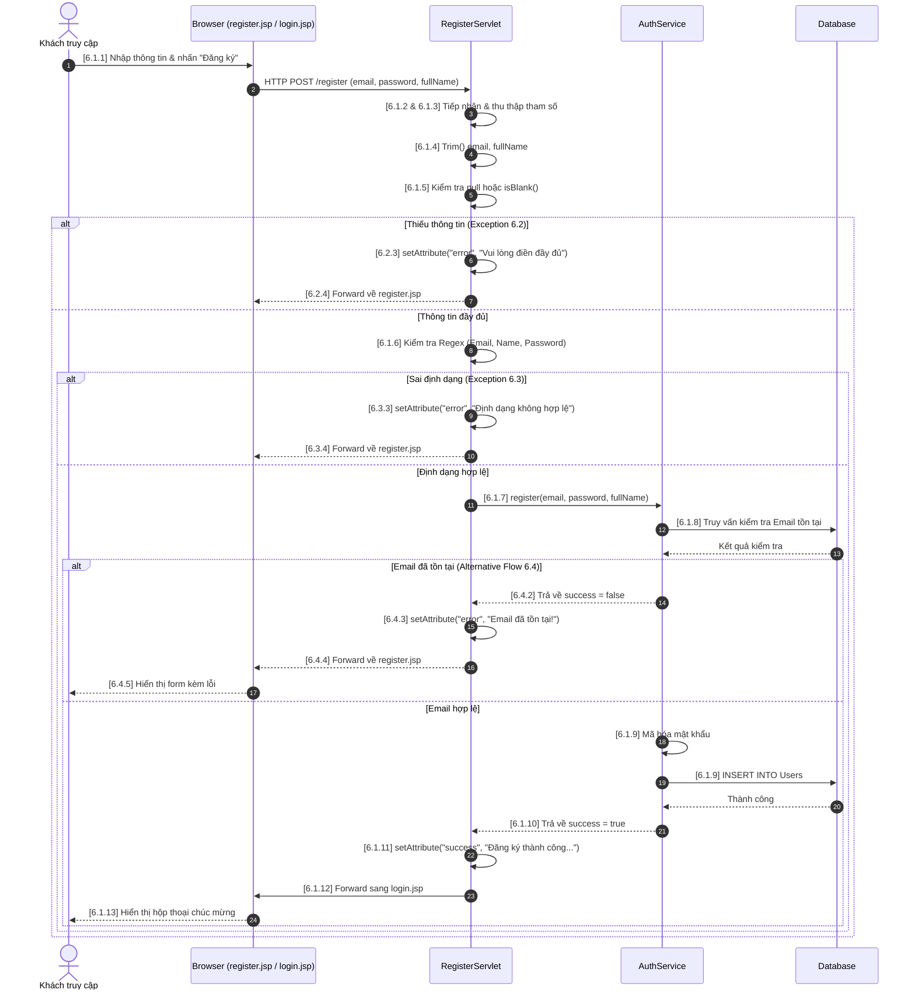

USE CASE SPECIFICATION
USECASE 06: Đăng ký tài khoản

1. Introduction
Use case này mô tả quy trình một người dùng mới tạo tài khoản trên hệ thống Web lưu trữ hình ảnh. Quy trình này tiếp nhận thông tin định danh cá nhân thông qua phương thức HTTP POST, thực hiện kiểm tra tính toàn vẹn dữ liệu, xác thực tính duy nhất của email và khởi tạo bản ghi người dùng mới trong cơ sở dữ liệu.

2. Use Case Description
Tên Use Case: Đăng ký
Số hiệu Use Case: 06
Mô tả: Cho phép khách truy cập tạo tài khoản thành viên mới bằng cách cung cấp Họ tên, Email và Mật khẩu. Hệ thống tiếp nhận, kiểm tra tính hợp lệ và lưu thông tin vào cơ sở dữ liệu, sau đó chuyển hướng họ đến trang đăng nhập.
Tác nhân chính: Khách truy cập (Guest / Người dùng chưa đăng nhập)
Tác nhân phụ: Hệ thống (Database)

3. Pre-Conditions
Khách truy cập đã vào đúng trang đăng ký tài khoản của hệ thống (/register.jsp).
Địa chỉ email được sử dụng để đăng ký chưa từng tồn tại trên hệ thống.

4. Trigger
Người dùng điền đầy đủ thông tin vào form đăng ký trên giao diện và nhấn nút "Đăng ký".

5. Post-Conditions
Tài khoản của người dùng mới được khởi tạo và lưu trữ thành công trong cơ sở dữ liệu.
Người dùng được chuyển tiếp sang trang đăng nhập (/login.jsp) cùng thông báo đăng ký thành công.

6. Normal Flow <Đăng ký> : UseCase 06
6.1.1. Người dùng điền đầy đủ thông tin (Họ tên, Email, Mật khẩu) vào form đăng ký trên giao diện và nhấn nút "Tạo tài khoản".
6.1.2. Hệ thống (RegisterServlet) tiếp nhận yêu cầu gửi lên thông qua phương thức HTTP POST.
6.1.3. Hệ thống thu thập ba tham số từ Request Parameter bao gồm: email, password, và fullName.
6.1.4. Hệ thống tự động loại bỏ các khoảng trắng thừa ở đầu và cuối của chuỗi dữ liệu Email và Họ tên thông qua hàm .trim().
6.1.5. Hệ thống kiểm tra điều kiện dữ liệu bắt buộc: Xác định cả ba tham số không được phép mang giá trị rỗng hoặc chỉ chứa toàn khoảng trắng.
6.1.6. Hệ thống kiểm tra định dạng dữ liệu (Validation): Đảm bảo Email đúng cấu trúc, Họ tên hợp lệ, và Mật khẩu đủ mạnh (Regex).
6.1.7. Lớp điều khiển gọi hàm nghiệp vụ xử lý đăng ký thuộc tầng dịch vụ AuthService.
6.1.8. AuthService kết nối xuống cơ sở dữ liệu để kiểm tra sự tồn tại của Email.
6.1.9. Khi xác nhận Email chưa tồn tại, hệ thống thực hiện mã hóa mật khẩu và chèn một bản ghi người dùng mới vào bảng dữ liệu.
6.1.10. Tiến trình xử lý dữ liệu hoàn tất thành công, trả về trạng thái kết quả success = true.
6.1.11. Hệ thống đính kèm thông báo thành công vào thuộc tính Request: "Đăng ký thành công! Vui lòng đăng nhập."
6.1.12. Hệ thống thực hiện chuyển tiếp (Forward) luồng xử lý và dữ liệu sang trang đăng nhập (/login.jsp).
6.1.13. Trang login.jsp tiếp nhận dữ liệu, hiển thị hộp thoại thông báo chúc mừng và sẵn sàng cho người dùng thực hiện đăng nhập. Kết thúc Use Case.

7. Alternate Flows
6.4. Alternative Flow: Email đăng ký đã tồn tại trên hệ thống
6.4.1. Tại bước 6.1.8, nếu AuthService phát hiện địa chỉ email này đã được sử dụng bởi một tài khoản khác.
6.4.2. Hàm nghiệp vụ trả về trạng thái kết quả thất bại (success = false).
6.4.3. Hệ thống đính kèm thông báo lỗi "Email đã tồn tại!" vào thuộc tính Request.
6.4.4. Hệ thống thực hiện chuyển tiếp ngược lại trang đăng ký (/register.jsp).
6.4.5. Trình duyệt hiển thị lại form đăng ký cùng thông báo lỗi để người dùng thay đổi email khác.

8. Exceptions
6.2. Exception: Người dùng điền thiếu thông tin hoặc thông tin chỉ chứa khoảng trắng
6.2.1. Tại bước 6.1.5, nếu một trong ba tham số truyền lên bị rỗng (null) hoặc người dùng cố tình nhập toàn dấu cách vào các ô nhập liệu.
6.2.2. Hệ thống ngừng luồng xử lý nghiệp vụ ngay lập tức, không gọi xuống tầng AuthService.
6.2.3. Hệ thống đính kèm thông báo cảnh báo lỗi "Vui lòng điền đầy đủ thông tin".
6.2.4. Hệ thống thực hiện giữ chân người dùng tại trang đăng ký bằng cách chuyển tiếp luồng (forward). Trình duyệt hiển thị thông báo lỗi. Kết thúc luồng.

6.3. Exception: Định dạng dữ liệu không hợp lệ
6.3.1. Tại bước 6.1.6, nếu email sai định dạng, hoặc họ tên chứa ký tự không hợp lệ, hoặc mật khẩu yếu.
6.3.2. Hệ thống ngừng luồng xử lý nghiệp vụ ngay lập tức.
6.3.3. Hệ thống đính kèm thông báo cảnh báo lỗi tương ứng với dữ liệu sai định dạng.
6.3.4. Hệ thống thực hiện giữ chân người dùng tại trang đăng ký bằng cách chuyển tiếp luồng. Trình duyệt hiển thị thông báo lỗi. Kết thúc luồng.

9. Includes
(Không có)

10. Special Requirements
Mật khẩu của người dùng bắt buộc phải được băm bảo mật ở tầng AuthService trước khi lưu xuống cơ sở dữ liệu để đảm bảo an toàn thông tin.
Quá trình chuyển tiếp dữ liệu phải diễn ra nhanh chóng, biểu mẫu đăng ký cần xóa sạch trường mật khẩu khi có lỗi quay lại để bảo mật.
Hệ thống phải có Regex kiểm tra định dạng email chuẩn, Regex họ tên chỉ gồm chữ cái/khoảng trắng, và Regex mật khẩu phức tạp.

11. Assumptions
Kết nối cơ sở dữ liệu giữa server và DB luôn thông suốt trong quá trình kiểm tra trùng lặp và ghi dữ liệu.

12. Associated Features or Functional Requirements
RF06.1: Cung cấp tính năng đăng ký tài khoản thành viên mới cho người dùng ẩn danh.
RF06.2: Tự động phát hiện, ngăn chặn hành vi đăng ký trùng lặp định danh email và hiển thị cảnh báo trực quan.
RF06.3: Kiểm soát chặt chẽ định dạng dữ liệu đầu vào để bảo mật và toàn vẹn dữ liệu.

---

## 13. Sequence Diagram (Biểu đồ tuần tự)

