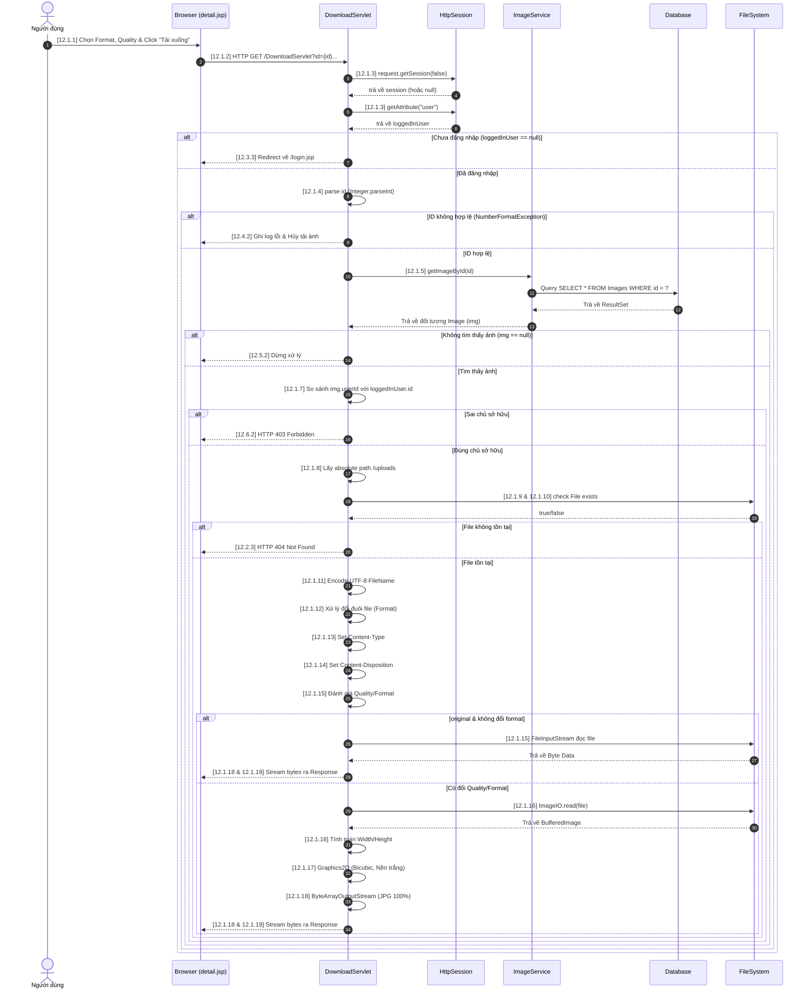

# USE CASE SPECIFICATION: Tải ảnh (Cập nhật)

## 1. Introduction
Use case này mô tả quy trình người dùng thực hiện tải một tệp tin hình ảnh từ hệ thống lưu trữ về thiết bị cá nhân. Chức năng này đã được nâng cấp để hỗ trợ xác thực quyền sở hữu, cho phép thay đổi định dạng (Format) và điều chỉnh chất lượng/độ phân giải ảnh (Quality) ngay trong quá trình tải. Hệ thống sẽ xử lý đồ họa trên Server-side, cấu hình chuẩn Header và stream dữ liệu nhị phân về Client.

## 2. Use Case Description
Tên Use Case: Tải ảnh về
Số hiệu Use Case: 12
Mô tả: Cho phép người dùng chọn chất lượng và định dạng mong muốn rồi nhấn nút "Tải xuống". Hệ thống sẽ: Kiểm tra quyền sở hữu (chỉ chủ bức ảnh mới được tải), truy vấn file gốc, dùng Java 2D API để resize hoặc đổi đuôi file nếu cần với thuật toán chất lượng cao (Bicubic), và cuối cùng thiết lập HTTP Headers để trình duyệt tải tệp tin về an toàn.
Tác nhân chính: Người dùng (User)
Tác nhân phụ: Hệ thống (Database, Hệ thống tệp tin Server)

## 3. Pre-Conditions
Người dùng đã đăng nhập vào hệ thống (Có Session hợp lệ).
Người dùng phải là chủ sở hữu của bức ảnh (`userId` của ảnh phải khớp với `id` của người dùng đang đăng nhập).
Bức ảnh yêu cầu tải phải có thông tin bản ghi hợp lệ trong cơ sở dữ liệu.

## 4. Trigger
Người dùng chọn định dạng, chất lượng và nhấn vào nút lệnh "Tải xuống" của một hình ảnh bất kỳ trên giao diện chi tiết.

## 5. Post-Conditions
Tệp tin hình ảnh được tải xuống thiết bị của người dùng thành công với đúng định dạng, chất lượng và tên file đã được chuẩn hóa. Dữ liệu gốc trên Server không bị thay đổi.

## 6. Normal Flow <Tải ảnh về> : UseCase 12
12.1.1. Người dùng thao tác chọn định dạng (Format), chất lượng (Quality) và nhấn nút "Tải xuống" trên giao diện chi tiết ảnh.
12.1.2. Hệ thống tiếp nhận các tham số được truyền lên từ client thông qua Request Parameter bao gồm: `id`, `quality` (chất lượng), và `format` (định dạng).
12.1.3. Hệ thống kiểm tra phiên đăng nhập hiện tại từ `HttpSession`.
12.1.4. Hệ thống kiểm tra tham số `id` (khác null) và ép kiểu chuỗi sang số nguyên.
12.1.5. Controller gọi tầng nghiệp vụ `ImageService` để tìm thông tin ảnh bằng hàm getImageById(id).
12.1.6. Hệ thống xác nhận đối tượng ảnh `img` tồn tại hợp lệ trong cơ sở dữ liệu.
12.1.7. Hệ thống kiểm tra quyền bằng cách so sánh `img.getUserId()` với `loggedInUser.getId()`.
12.1.8. Hệ thống lấy đường dẫn vật lý tuyệt đối đến thư mục lưu trữ `/uploads`.
12.1.9. Hệ thống khởi tạo đối tượng `File` dựa trên đường dẫn gốc và thuộc tính `filePath` của ảnh.
12.1.10. Hệ thống xác minh file vật lý thực sự tồn tại trên ổ cứng.
12.1.11. Hệ thống mã hóa tên tệp tin gốc sang UTF-8 (`URLEncoder.encode`).
12.1.12. Hệ thống kiểm tra tham số `format`. Nếu người dùng yêu cầu đổi đuôi, hệ thống tiến hành cắt chuỗi và cập nhật lại phần mở rộng (extension) của tên file tải về.
12.1.13. Hệ thống thiết lập Content-Type: `application/octet-stream`.
12.1.14. Hệ thống thiết lập thuộc tính `Content-Disposition` với tham số `attachment` kèm theo tên file đã được chuẩn hóa.
12.1.15. Hệ thống đánh giá tham số `quality` và `format`. Nếu không thay đổi, truyền luồng gốc (FileInputStream ra OutputStream) và kết thúc nhánh hệ thống.
12.1.16. Nếu có thay đổi (Resize/Format), hệ thống tải file gốc vào bộ nhớ đồ họa (`BufferedImage`), tính toán kích thước mới giữ đúng tỷ lệ khung hình.
12.1.17. Hệ thống sử dụng `Graphics2D` (chất lượng tối đa Bicubic, đổ nền trắng nếu xuất JPG) để vẽ lại ảnh.
12.1.18. Hệ thống ghi ảnh ra `ByteArrayOutputStream` (ép chất lượng 100% nếu là JPG), cấu hình `Content-Length` và đẩy byte ra HTTP Response. Đóng luồng.
12.1.19. Thiết bị của Người dùng tiếp nhận luồng dữ liệu mạng, hiển thị hộp thoại tải xuống và lưu trữ tệp tin hình ảnh hoàn chỉnh vào bộ nhớ cục bộ. Kết thúc Use Case.

## 7. Alternate Flows
12.2. Alternative Flow: File ảnh không tồn tại vật lý trên ổ đĩa Server
12.2.1. Tại bước 12.1.10, nếu file gốc trong thư mục `/uploads` đã bị xóa hoặc mất.
12.2.2. Hệ thống ngừng luồng xử lý thiết lập Header và truyền tải file.
12.2.3. Hệ thống trả về mã lỗi HTTP 404 cùng thông báo: `File không tồn tại trên server!`. Kết thúc luồng.

## 8. Exceptions
12.3. Exception: Người dùng chưa đăng nhập
12.3.1. Tại bước 12.1.3, nếu `loggedInUser` là null.
12.3.2. Hệ thống dừng luồng tải ảnh.
12.3.3. Hệ thống dùng `response.sendRedirect` để điều hướng người dùng về trang `/login.jsp`. Kết thúc luồng.

12.4. Exception: Lỗi định dạng tham số ID
12.4.1. Tại bước 12.1.4, nếu tham số "id" không hợp lệ gây ra lỗi `NumberFormatException`.
12.4.2. Hệ thống nhảy vào khối catch và ghi log lỗi. Luồng tải ảnh bị hủy bỏ. Kết thúc luồng.

12.5. Exception: Không tìm thấy ảnh trong database
12.5.1. Tại bước 12.1.6, nếu đối tượng `img` trả về bằng null.
12.5.2. Hệ thống dừng toàn bộ tiến trình xử lý mà không có file nào được trả về. Kết thúc luồng.

12.6. Exception: Cố tình truy cập trái phép (Lỗi quyền sở hữu)
12.6.1. Tại bước 12.1.7, nếu ID người dùng hiện tại không khớp với `userId` của bức ảnh.
12.6.2. Hệ thống từ chối quyền truy cập, trả về mã lỗi HTTP 403 (Forbidden) kèm thông báo lỗi. Kết thúc luồng.

## 9. Includes
(Không có)

## 10. Special Requirements
Quá trình xử lý ảnh trên RAM (`BufferedImage`) cần được tối ưu và hàm `dispose()` phải được gọi để tránh Memory Leak.
Đảm bảo tên file chứa tiếng Việt có dấu luôn được giữ nguyên khi hộp thoại tải về bật lên trên mọi trình duyệt.
Thuật toán nén/đổi định dạng phải chặn lỗi mất nền trong suốt (Alpha channel) sinh ra mảng đen khi chuyển đổi từ PNG sang JPG.

## 11. Assumptions
Hệ thống server được cấu hình đủ tài nguyên RAM để chạy đồ họa Java 2D khi có nhiều luồng request tải ảnh đồng thời.
Thư mục lưu trữ `/uploads` có đủ quyền đọc (`Read Permission`).

## 12. Associated Features
RF12.1: Bảo mật quyền sở hữu hình ảnh (Chỉ Owner mới được quyền Download).
RF12.2: Tải xuống và chuyển đổi định dạng ảnh (PNG, JPG, GIF).
RF12.3: Cho phép Resize độ phân giải ảnh để tiết kiệm dung lượng.
RF12.4: Xử lý đồ họa ảnh chất lượng cực cao (Bicubic) & Bảo toàn màu sắc nguyên bản.

---

## 13. Sequence Diagram (Biểu đồ tuần tự)

